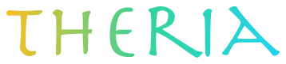

<div align="center">


<h1></h1>

<h3>Shapeshifter tribes clash over the savanna and the jungle — fight as both human and beast</h3>

<p>
  <a href="https://github.com/ajhahnde/Theria/actions/workflows/ci.yml"></a>
  
  
  
  
</p>

<p>
  <b>README</b> ·
  <a href="CHANGELOG.md"><b>Changelog</b></a> ·
  <a href="CREDITS.md"><b>Credits</b></a> ·
  <a href="LICENSE"><b>License</b></a>
</p>

</div>

---

## About

Theria is a top-down multiplayer online battle arena built in Godot 4, set in a
world of shapeshifters — tribes whose members fight in both a human and an animal
form. Two teams of three, each drawn from a shapeshifter people, contest savanna
lanes and an equatorial jungle to break each other's nexus.

The first milestone is a **walking skeleton**: one player-controlled hero and
one bot moving on the 3v3 arena under a server-authoritative, fixed-timestep
simulation. With that authority model proven, networked play over a
listen-server, the hero ability layer, and two full rosters of heroes — the
**Solane**, savanna big-cat shifters (lion, cheetah, hyena), and the opposing
**Verdani**, jungle venom-and-shadow shifters (snake, spider, chameleon) — now
run on top of it. A practice match fields one tribe against the other — `--hero`
picks any hero, the player drives it and bots fill out both squads — so both
rosters are on the field at once. The Verdani fight by attrition: their venom
lingers as damage over time and their webs slow what they catch, a foil to the
Solane's burst. Multi-hero teams over the wire and the art direction come next.

## Playtesting

Theria self-updates, so you install it once and always launch the latest build.

1. Download the launcher for your platform from the
   [latest release](https://github.com/ajhahnde/Theria/releases) — `Theria-windows.zip`
   (Windows) or `Theria-macos.zip` (macOS).
2. Unzip and run it. On launch it briefly checks for a newer build, downloads it if there is
   one, and starts. Every build after that arrives automatically — you never re-download.

It is offline-safe: with no connection it simply starts the build you already have, and an
update never touches your settings or saved data.

**macOS** builds are unsigned for now, so Gatekeeper blocks the first launch. Clear the
quarantine flag once, then open the app normally:

```sh
xattr -dr com.apple.quarantine /path/to/Theria.app
```

Building Theria yourself instead of playtesting a release? See [Running](#running).

## Architecture

The simulation is the single source of truth. `SimCore` is a deterministic,
side-effect-free step function that advances the world by a fixed 1/60 s tick
from input alone — no rendering, no engine input, no global state. The same
core is driven by:

- the local client (`src/client`), which samples the keyboard and draws the
  resulting state;
- the bot (`src/bot`), which derives its command from the world state;
- the headless tests (`test/`), which replay scripted input and assert the
  outcome;
- the networked drivers (`src/net`), where a host simulates and broadcasts the
  world and a client sends its input up and renders the snapshots it receives.

Because authority lives entirely in the simulation, networked play is just
another driver — a listen-server — added without rewriting gameplay. The host is
the sole authority. A client never owns authority, but it predicts its own hero
locally so input feels instant, reconciling against every snapshot: it rolls back
to the server's state and replays the inputs the server has not yet applied, using
the same movement code the server runs. Remote units — the enemy hero, creeps, and
structures — are rendered a short delay in the past, interpolated between buffered
snapshots, so they move smoothly through network jitter and dropped packets; that
delay adapts to the connection's measured jitter rather than being fixed.

## Layout

| Path           | Contents                                              |
| :------------- | :---------------------------------------------------- |
| `src/sim`    | The authoritative simulation core, its data types, and the data-driven hero ability layer. |
| `src/bot`    | Bot input derived from the world state.               |
| `src/net`    | Listen-server transport, the client/server wire protocol, remote-entity interpolation, and the playtest link-condition simulator. |
| `src/client` | The title screen, the boot/update screen, local input sampling, and rendering. |
| `src/update` | The in-client auto-updater — manifest logic and the build download/swap. |
| `test/unit`  | Headless tests of the simulation and the wire protocol. |
| `scenes`     | Godot scenes.                                         |
| `assets`     | Art assets — the placeholder hero models (see [`CREDITS.md`](CREDITS.md)). |

## Running

Open the project in Godot 4.6 and press Play, or from the command line:

```sh
godot --path .
```

A connect screen opens: choose **Practice** for a single-machine match, **Host** to
start a listen-server, or type an address and **Join** one. Practice is a tribe-vs-tribe
match: pick the hero you drive from the menu's roster list — any hero of either tribe — and
that hero's tribe fields your team while the opposing tribe fills the bots, so picking the
snake puts you on the Verdani against the Solane, and the default lion keeps the Solane
against the Verdani. The command line's `--hero` makes the same choice for a launch that
skips the menu. Bots drive the other five seats. A hosted or joined match is still a
one-hero-per-team duel on the lion until multi-hero play
reaches the wire. Move the hero by **right-clicking** where it should go — click-to-move, like a MOBA — and the bots fight to their kit's
stance — brawlers close on the nearest enemy and shift into the form that keeps a hit
in reach (into the animal kit when an enemy slips inside the human poke, back to the
human form to poke or heal), while the skirmishers (Cheetah, Chameleon) hold their
poke range and back off rather than melee — and all cast their own kits, healing when
hurt and otherwise firing the reachable ability of their form. Cast its abilities with
**Q W E R**, aimed at the mouse cursor — the hero shifts between a human and an animal
form (shown by the ring around it, white or amber), each form a different set of
abilities drawing on its own resource (the bar under the health bar). Each hero appears as
its own animal — a placeholder low-poly model washed in its team colour — so your three
squadmates read apart by species at a glance. Abilities are
cast in a single-machine or hosted match; a joined client moves but does not yet
cast.

### Multiplayer

The connect screen's **Host** and **Join** cover multiplayer. The same roles can be
selected on the command line, which skips the menu — this is how a headless run picks
a role, since a menu cannot be driven without a display:

```sh
godot --path . -- --host             # host the match (you are team 0)
godot --path . -- --join 127.0.0.1   # join a host at an address (you are team 1)
godot --path . -- --local            # a single-machine practice match, no menu
godot --path . -- --local --hero snake     # drive a Verdani hero (your team fields the Verdani)
```

The host is authoritative and fills any empty player slot with a bot. The joining
player's hero is predicted locally, so it responds without waiting on the host.

A local machine and a clean LAN deliver snapshots almost perfectly, so the smoothing
that exists to ride out a bad connection is never really exercised. To see it work, a
joining player can simulate a worse link on their incoming snapshot stream:

```sh
# join with 150 ms latency, 50 ms of jitter, and 10% packet loss
godot --path . -- --join 127.0.0.1 --netsim 150,50,0.1
```

This shapes only what the client receives — it changes nothing the host sends and no
wire bytes — and makes the remote units visibly buffer further behind and the
interpolation cover the dropped snapshots. It is a debug aid, not a gameplay option.

## Testing

Tests run headless with [GUT](https://github.com/bitwes/Gut):

```sh
godot --headless -s addons/gut/gut_cmdln.gd -gdir=res://test -ginclude_subdirs -gexit
```

Linting uses the [GDScript toolkit](https://github.com/Scony/godot-gdscript-toolkit):

```sh
gdlint src test
```

Both run in continuous integration on every push and pull request.

## License

Apache License 2.0 — see [`LICENSE`](LICENSE). Bundled third-party art assets carry
their own licenses, credited in [`CREDITS.md`](CREDITS.md).

## See also

- [FlashOS](https://github.com/ajhahnde/FlashOS) — AArch64 bare-metal kernel for the Raspberry Pi 4B and QEMU.
- [Flash](https://github.com/ajhahnde/Flash) — a systems language and Zig transpiler.
- [the-way-out](https://github.com/ajhahnde/the-way-out) — top-down pixel-art escape-room shooter.
- [eeco](https://github.com/ajhahnde/eeco) — self-maintaining workflow ecosystem.

---

[Next: Changelog →](CHANGELOG.md)
